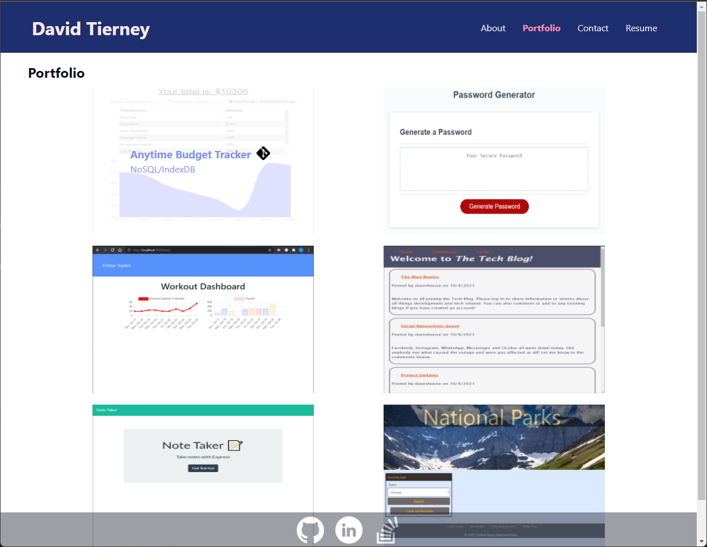

# My React Portfolio!

## David Tierney

Check out my latest projects and updates on my React portfolio page.

## Table of Contents

-[Link](#link)

-[Screenshot](#screenshot)

-[Technologies-Used](#technologies-used)

-[Contributions](#contributions)

-[Credits](#credits)

-[Questions](#questions)

## Link

[Check out this App here!]()

## Screenshot

 

## Technologies-Used

* [React](https://reactjs.org)
* [JSX](https://reactjs.org/docs/introducing-jsx.html)
* [GitHub Pages](https://pages.github.com/)

## Contributions

David Tierney

## Credits

Trilogy Education Services

## Questions:

[GitHub](https://github.com/daveshouse44)

[LinkedIn](https://www.linkedin.com/in/david-tierney-652030214/)

[Email: daveshouse44@hotmail.com](mailto:daveshouse44@hotmail.com)